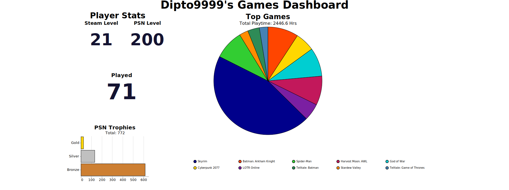
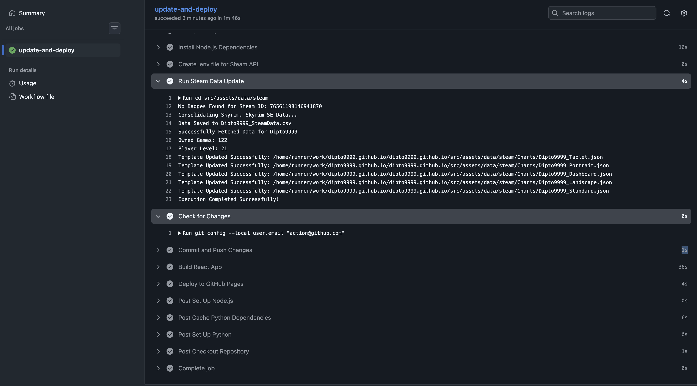
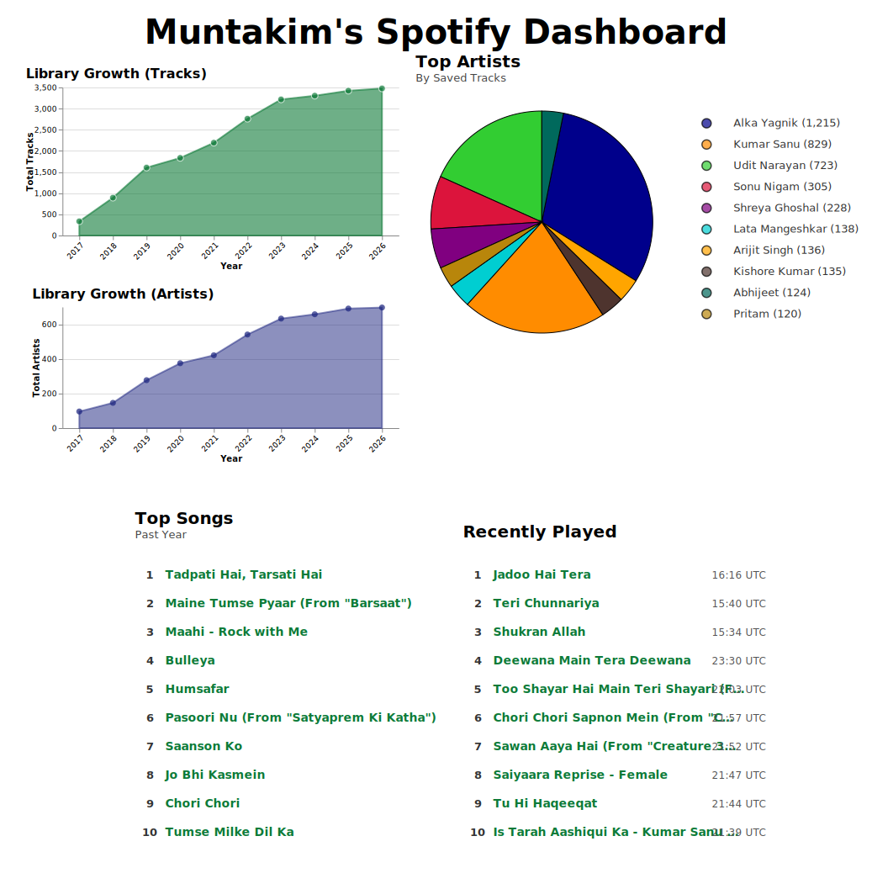
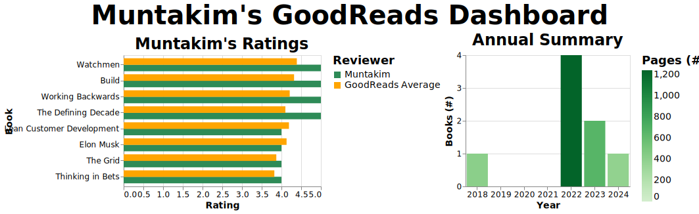

# Muntakim Rahman : Developer Portfolio

 ## Contents

* [Overview](#Overview)
* [Dashboards](#Dashboards)
    * [Games](#Games)
    * [Spotify](#Spotify)
    * [GoodReads](#GoodReads)

## Overview

This is my portfolio website, where I have included my academic and project highlights so far in my career. I have also included some stats of my hobbies and pasttimes with use of online **API**s.

This is my portfolio website, where I've highlighted academic achievements and my engineering projects. I also showcase some hobby stats with data visualizations, presented in a responsive **React** web app.

## Dashboards

### Games

I pulled my gaming data from both **Steam** and **PlayStation Network** using the [`games.py`](src/assets/data/games/games.py) **Python** script.
Both data sources are merged — playtime for cross-platform titles is summed — and visualized with **vega-altair**.

The initial [`Dipto_9999_Games_Dashboard_Standard.json`](src/assets/data/games/Charts/Dipto_9999_Games_Dashboard_Standard.json) and related chart assets
were migrated to the **React** application and further adjusted for browser responsiveness.

    

#### Steam

I pulled my **Steam** account data using the [`steam.py`](src/assets/data/games/steam/steam.py) **Python** script, which interacts with the **Steam Web API**.
After fetching, the data was processed and cleaned with **pandas**.

#### PlayStation Network

I pulled my **PlayStation Network** account data using the [`psn.py`](src/assets/data/games/psn/psn.py) **Python** script via the **PSNAWP** library.
After fetching, the data was processed and cleaned with **pandas**. Trophy data is also included in the unified dashboard.

#### Automation

This data is automatically updated with **GitHub Actions** every day at **6 AM UTC**.

    

### Spotify

I pulled my account data from the **Spotify API** using the [`spotify.py`](src/assets/data/spotify/spotify.py) **Python** script.
After fetching, the data was processed and cleaned with **pandas**, then visualized with **vega-altair**.

The initial [`Muntakim_Dashboard.json`](src/assets/data/spotify/Charts/Muntakim_Dashboard.json) and related chart assets
were migrated to the **React** application and further adjusted for browser responsiveness.

    

<i>This section was almost completely AI generated and programmed by training Claude Code on my previous dashboards.</i>

#### Automation

This data is automatically updated with **GitHub Actions** every day at **6 AM UTC**.

### GoodReads

GoodReads doesn't provide access to its **API** for new users. I exported my user data from the website, cleaned, and visualized the data in the [`GoodReads_Stats.ipynb`](src/assets/data/goodreads/GoodReads_Stats.ipynb) **Jupyter Notebook**.

The initial [`Muntakim_Dashboard.json`](src/assets/data/goodreads/Charts/Muntakim_Dashboard.json) and related chart assets
were migrated to the **React** application and further adjusted for browser responsiveness.

    

