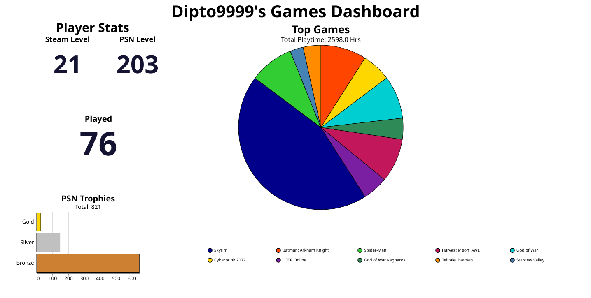
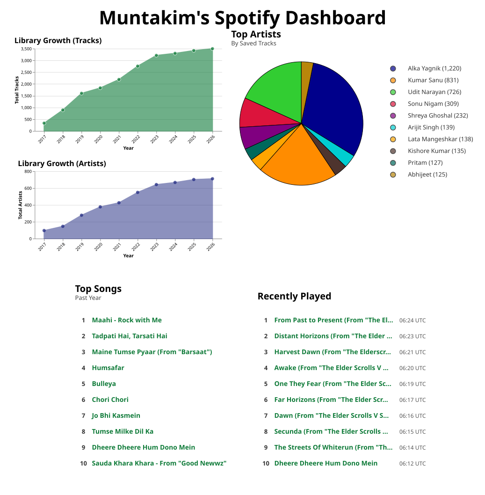
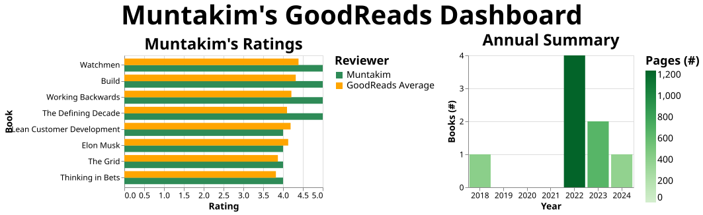

# Muntakim Rahman : Developer Portfolio

 ## Contents

* [Overview](#Overview)
* [Dashboards](#Dashboards)
    * [Games](#Games)
    * [Spotify](#Spotify)
    * [GoodReads](#GoodReads)
    * [Automation](#Automation)

## Overview

This is my portfolio website, where I have included my academic and project highlights so far in my career. I have also included some stats of my hobbies and pasttimes with use of online **API**s.

This is my portfolio website, where I've highlighted academic achievements and my engineering projects. I also showcase some hobby stats with data visualizations, presented in a responsive **React** web app.

## Dashboards

### Games

I pulled my gaming data from both **Steam** and **PlayStation Network** using the [`games.py`](src/assets/data/games/games.py) **Python** script.
Both data sources are merged — playtime for cross-platform titles is summed — and visualized with **vega-altair**.

The initial [`Dipto_9999_Games_Dashboard_Standard.json`](src/assets/data/games/Charts/Dipto_9999_Games_Dashboard_Standard.json) and related chart assets
were migrated to the **React** application and further adjusted for browser responsiveness.

    

#### Steam

I pulled my **Steam** account data using the [`steam.py`](src/assets/data/games/steam/steam.py) **Python** script, which interacts with the **Steam Web API**.

#### PlayStation Network

I pulled my **PlayStation Network** account data using the [`psn.py`](src/assets/data/games/psn/psn.py) **Python** script via the **PSNAWP** library.

This uses an **NPSSO** token from following the steps below:

1. Sign in at [playstation.com](https://www.playstation.com/).
2. Open [https://ca.account.sony.com/api/v1/ssocookie](https://ca.account.sony.com/api/v1/ssocookie).
3. Copie the `npsso` value to [`psn/.env`](src/assets/data/games/psn/.env), where it is used by **GitHub Actions**.

*Note: The token must be refreshed due to expiry every 60 days.*

### Spotify

I pulled my account data from the **Spotify API** using the [`spotify.py`](src/assets/data/spotify/spotify.py) **Python** script.
After fetching, the data was processed and cleaned with **pandas**, then visualized with **vega-altair**.

The initial [`Muntakim_Dashboard.json`](src/assets/data/spotify/Charts/Muntakim_Dashboard.json) and related chart assets
were migrated to the **React** application and further adjusted for browser responsiveness.

    

<i>This section was almost completely AI generated and programmed by training Claude Code on my previous dashboards.</i>

This uses a **Spotify** refresh token from following the steps below:

1. Run [`spotify.py`](src/assets/data/spotify/spotify.py) locally and sign in at the **Spotify** prompt.
2. Copy [`spotify/.cache`](src/assets/data/spotify/.cache) to the **GitHub Actions** secret `SPOTIFY_TOKEN_CACHE`.

*Note: The token must be refreshed if **Spotify** returns `invalid_grant` / refresh token revoked.*

### GoodReads

GoodReads retired their public **API** in 2020, so this dashboard is built from their public **RSS** shelf feeds instead.
I pull the `read`, `currently-reading`, and `to-read` shelves with [`goodreads.py`](src/assets/data/goodreads/goodreads.py), clean the data with **pandas**, and visualize it with **vega-altair**.

The generated [`Charts/`](src/assets/data/goodreads/Charts) Vega-Lite JSONs (`Standard` / `Tablet` / `Landscape` / `Portrait`) were migrated to the **React** application and adjusted for browser responsiveness.

    

### Automation

This data is automatically updated with **GitHub Actions** every day at **6 AM UTC**.