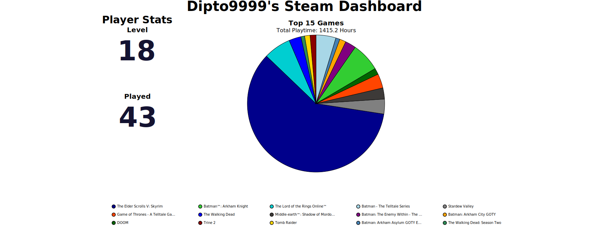

# Muntakim Rahman : Developer Portfolio

 ## Contents

* [Overview](#Overview)
* [Dashboards](#Dashboards)
    * [Steam](#Steam)

## Overview

This is my portfolio website, where I have included my academic and project highlights so far in my career. I have also included some stats of my hobbies and pasttimes with use of online **API**s.

This is my portfolio website, where I've highlighted academic achievements and my engineering projects. I also showcase some hobby stats with data visualizations, presented in a responsive **React** web app.

## Dashboards

### Steam Dashboard

I pulled my account data from the **Steam API** using the [`steam.py`](src/assets/data/steam/steam.py) Python script.
After fetching, the data was processed and cleaned with **pandas**, then visualized with **vega-altair**.

The initial [`Dipto9999_Dashboard.json`](src/assets/data/steam/Charts/Dipto9999_Dashboard.json) and related chart assets
were migrated to the React application and further adjusted for browser responsiveness.

    

